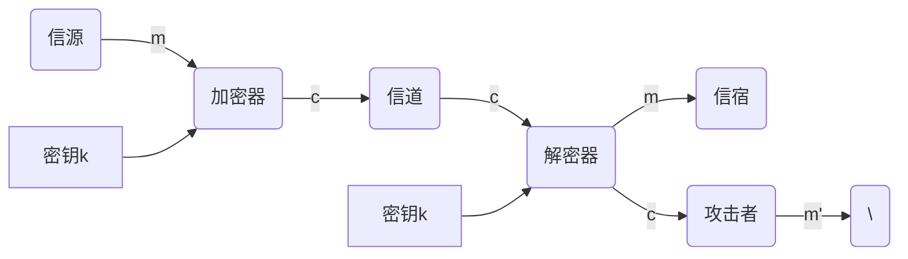

# Chapter 1
什么是网络空间安全？为什么网络空间安全存在严峻的信息安全问题
---

网络空间(Cyberspace)是信息时代人们来意生存的信息环境，是所有信息系统的集合。

网络空间是人和信息的生存环境，网络空间安全是是人和信息对网络空间的**基本要求**

信息安全的三大定律是什么？对我们的学习和工作有什么作用？
---
- 信息安全的普遍性定律：哪里有信息，哪里就有信息安全问题
- 信息安全的中性定律：安全与方便是一对矛盾
- 信息安全的就低性定律（木桶原理）：信息系统的安全性取决于最薄弱部分的安全性


网络空间安全学科的主要研究方向及内容是什么？
---
主要研究方向和它们的主要研究内容

- 密码学
    - 对称密码
    - 公钥密码
    - 哈希函数
    - 密码协议
    - 新型密码：生物密码、量子密码、混沌密码等；
    - 密码管理
    - 密码应用
- 网络安全
    - 网络安全威胁
    - 通信安全
    - 协议安全
    - 网络防护
    - 入侵检测与态势感知
    - 应急响应与灾难恢复
    - 可信网络
    - 网络安全管理
- 系统安全
    - 系统的安全威胁
    - 系统的设备安全
    - 系统的硬件子系统安全
    - 系统的软件子系统安全
    - 访问控制
    - 可信计算
    - 系统安全等级保护
    - 系统安全测评认证
    - 应用信息系统安全
- 内容安全
    - 内容安全的威胁
    - 内容的获取
    - 内容的分析与识别
    - 内容安全管理
    - 信息隐藏
    - 隐私保护
    - 内容安全的法律保障
- 信息对抗
    - 通信对抗
    - 雷达对抗
    - 光电对抗
    - 计算机网络对抗


网络空间安全学科的理论基础是什么？这些理论基础对我们的专业学习和研究工作有什么指导意义？
---

- 数学
    - 数学是一切自然科学的理论基础，也是网络空间安全学科的理论基础
- 信息论、控制论和系统论
    - 信息论为了解决现代通信问题
    - 控制论在解决自动控制问题中建立
    - 系统论为解决现代大科学工程项目的组织管理问题而建立
- 计算理论
    - 计算安全问题
- 密码学理论
    - 特有的理论基础
- 访问控制理论
    - 核心

# Chapter 2

简述一个保密通信系统的数学模型由哪几个部分组成？p57




信息隐藏和信息保密有何本质区别？
| 信息隐藏                                                                                             | 信息保密                                                           |
| -------                                                                                              | --------                                                           |
| 秘密信息被嵌入表面上看起来无害的宿主信息中，攻击者无法直观地判断他所监视的信息中是否包含有秘密信息 | 利用单钥或双钥密码算法把铭文变换成密文并通过公开信道送到接收者手中 |

随着新技术的发展，密码学面临哪些新的安全挑战
- 云计算/存储对密码学的新挑战
- 大数据对密码学的新挑战
- 物联网对密码学的新需求
- 新型计算机对密码学的新挑战
- 区块链技术对密码学的新挑战

保密学(Cryptology)是研究信息系统安全保密的科学，它包含了哪两个重要的研究分支？
- 密码编码学
- 密码分析学

密码体制从原理上可分为哪两大类？这两类密码体制在密钥的使用上有何不同？p65
- 单钥密码体制
    - 加密密钥和解密密钥相同
- 双钥密码体制
    - 每个用户都有一对选定的密钥：一个是公开的，称为公钥，以pk表示，另一个是秘密的，称为私钥，以sk表示

# Chapter 3

填空题

1. 安全性攻击可以划分为*被动攻击*和*主动攻击*  
p102
2. X.800定义的5类安全服务是**  
p108
    - 认证
    - 访问控制
    - 数据保密性
    - 数据完整性
    - 不可否认性
3. X.800定义的8种特定的安全机制是  
p110
    - 加密
    - 数字签名
    - 访问控制
    - 数据完整性
    - 认证交换
    - 流量填充
    - 路由控制
    - 公证
4. X.800定义的5种普遍的安全机制是
p111
    - 可信功能度
    - 安全标志
    - 事件检测
    - 安全审计跟踪
    - 安全恢复
5. 防火墙可以分为   7种类型  
p116
6. 静态包过滤防火墙工作于OSI模型的\_\_层上，它对数据包的某些特定域进行检查，这些特定域包括：  
p118 网络层
    - 数据源地址
    - 目的地址
    - 应用或协议
    - 源端口号
    - 目的端口号
7. 根据数据的来源不同，IDS可分为  3种类型  
p122
    - 基于网络的入侵检测系统
    - 基于主机的入侵检测系统
    - 分布式入侵检测系统
1. 一个通用的IDS模型主要由  4部分组成
p121
    - 数据收集器
    - 检测器
    - 知识库
    - 控制器
1. 根据访问方式的不同，VPN可以分为 和 两种类型  
p126
    - 远程访问VPN
    - 网关-网关VPN
1.  VPN的关键技术包括  等  
2.  移动互联网的组成结构主要包括  
p155
1.  移动互联网安全主要包括  
p156
    - 应用安全
        - 应用访问控制
        - 内容过滤
        - 安全隧道
        - 安全审计
    - 网络安全
        - 双向认证技术
        - 异常流量监控
        - 空中接口安全
        - GSM安全机制
        - 访问授权控制
        - 入侵检测机制
        - 攻击防御与溯源
        - 规范网络标准
    - 终端安全
        - 主动防御
        - 软件签名
        - 访问控制
        - 加密存储
1.  根据信息生成、传输、处理和应用的原则，物联网可以分为四层，分别为  
p158
    - 感知识别层
    - 网络构建层
    - 管理服务层
    - 综合运用层

思考题

1. 基本的安全威胁有哪些？  
p98
    - 信息泄露
    - 完整性破坏
    - 拒绝服务
    - 非法使用
3. 网络攻击的常见形式有哪些
    - 口令窃取
    - 欺骗攻击
    - 缺陷和后门攻击
    - 认证失效
    - 协议缺陷
    - 信息泄露
    - 指数攻击——病毒和蠕虫
    - 拒绝服务攻击
7. 入侵检测系统的定义是什么？  
p120
    - 对计算机系统风险和威胁进行分类的方法，并将威胁分为外部深入、内部渗入和不法行为，利用审计跟踪数据监视入侵活动
8. 入侵检测系统按照功能可分为哪几类？有哪些主要功能？
    - 基于网络的入侵检测系统
        - 截取网络中的数据包，提取其特征并与知识库中已知的攻击签名相比较，从而达到检测目的
        - 优点：
            - 侦测速度快
            - 隐蔽性好
            - 不易受到攻击，对主机资源消耗少
        - 缺点
            - 有些攻击由服务器的键盘发出，不经过网络，因而无法识别，误报率高
    - 基于主机的入侵检测系统
        - 数据来源与主机系统，通常是系统日志和审计记录。HIDS对系统日志和审计记录的不断监控和分析来发现攻击后的误操作
        - 优点：
            - 针对不同呕吐能够操作系统捕获应用层入侵，误报少
        - 缺点：
            - 依赖于主机及其子系统，实时性差
    - 分布式入侵检测系统
        - 能同时分析来自主机系统审计日志和网络数据流，一般分为分布式结构，由多个组件组成。从多个主机或网络传输取得数据。典型的DIDS采用控制台/探测器结构，NIDS和HIDS作为探测器放置在网络的关键节点，并向中央控制台汇报情况。攻击日志定时传送到控制台，并保存到中央数据库中，新的攻击特征能及时发送到各个检测器上。
9. 简述NIDS、HIDS和DISD三种IDS之间的区别

# Chapter 4

操作系统通常由进程管理、内存管理、外设管理、文件管理、处理器管理等子系统组成，是不是把这些子系统的安全机制实现好了，操作系统的安全目标就实现了？为什么？

请以Adept-50安全操作系统作为分析的例子，分析说明威胁风险、攻击、安全之间存在什么样的关系？

请分析说明基于特征的入侵检测和基于异常的入侵检测各有什么优缺点，并说明机器学习技术更适合于其中哪种检测

请结合例子说明针对数据库应用的SQL注入攻击的基本原理

> 通常应用系统的登陆界面会提供两个输入框，让用户在里面输入用户名和口令，对应的数据库访问语句如下：
> ```sql
> SELECT UserList.Username
>     FROM UserList
>     WHERE UserList.Username='Username'
>     AND UserList.Password='Password'
> ```
> 如果攻击者知道用户名但是不知道口令，他在用户名输入框中输入了正确的用户名后，可以在命令输入框输入：
> ```sql
> password' OR '1'='1
> ```
> 接收到这个输入后，上述数据库访问语句将被解释为以下形式：
> ```sql
> FROM UserList
>     WHERE UserList.Username='Username'
>     AND UserList.Password='password' OR '1'='1'
> ```

请分析说明跨站脚本(XSS)攻击威胁会给Web应用系统带来什么样的安全风险？

- 用户的cookie泄露，cookie中含有用户的敏感信息

请以跨站脚本(XSS)攻击威胁为例，设计一个运用安全生态系统思想实现Web应用环境下个人敏感信息保护的方案。

# Chapter 5

1. 你认为信息内容安全的主要技术有哪些？
    - 
2. 你认为信息内容安全技术上的发展能否解决所有的信息内容的安全问题？
5. 你认为信息内容安全威胁主要有哪些？
7. 网络信息内容的获取技术有哪些？简要说明每种网络信息内容获取技术的基本原理、主要流程。
21. 请简要说明信息过滤技术有哪些分类与应用。
22. 网络舆情监测与预警系统的核心功能主要包括哪几个方面？
24. 未来将影响网络舆情监测与预警系统的技术主要有哪些？

# Chapter 6

3. 简述数字证书有效性验证的步骤

6. 如果针对差分隐私机制保护的一个统计查询，是否可以无限地进行重复查询？为什么？

不能通过多次不同的查询方式推断出数据集中是否包含一个特定个体的数据。

10. 举例说明人工智能对网络安全的影响
