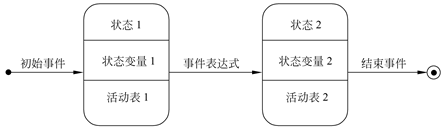
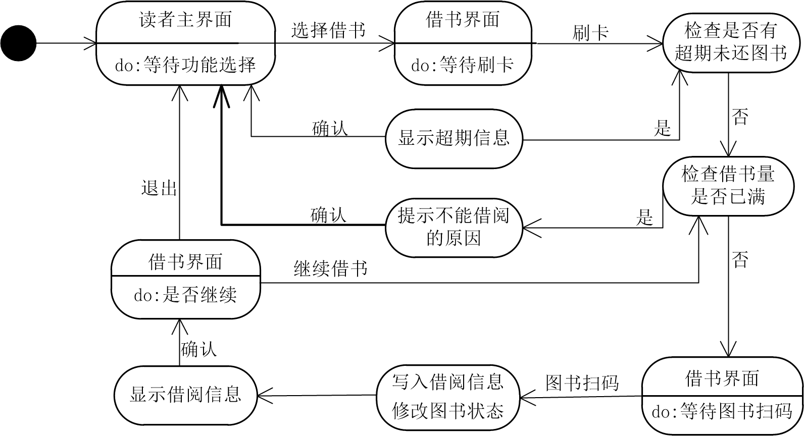
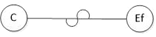
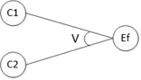
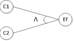
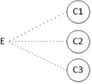
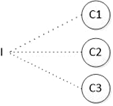
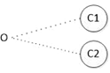
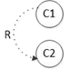
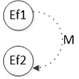

# 软件工程概述
##  软件生存周期

1. 问题定义
2. 可行性分析
3. 需求分析
4. 总体设计
5. 详细设计
6. 编码和单元测试
7. 综合测试软件维护

三个阶段：1,2,3;4,5,6,7;8

1.3 软件工程方法学

1.3.1 结构化方法

1.3.2 面向对象方法

面向对象方法(Object-Oriented Method, OOM)把面向对象的思想应用于软件开发过程中制导开发活动的系统方法，是建立在“对象”概念基础上的方法学，简称OO方法

主张从客观世界固有的事物来构造系统

# 结构化分析

## 问题定义

### 问题定义的规范化要求

规范化要求如下
1. 重视问题定义，不能把其当作一件小事
2. 客观、全面地定义，不能避重就轻、偷工减料
3. 清楚问题定义的工作内容，不能把问题定义当作解决方法
4. 深入分析，抓住问题的本质
5. 严格评审

### 问题定义实例

## 可行性研究

### 可行性研究的内容

1. 技术可行性
   1. 采集影响系统性能、可靠性、可维护性方面的信息
   2. 论证实现系统功能和性能需要的各种设备、技术、方法和过程。
   3. 分析项目开发在技术上担负的风险及对开发成本的影响。
   4. 如有可能研究鲜藕类似系统的功能、性能，采用的技术、工具、设备，开发过程中成功和失败的经验、教训，为系统开发做参考
2. 经济可行性
   1. 系统为用户增加的收入，可以用直接或间接的方法估算
   2. 估算项目的开发成本是否超过预期的利润
   3. 分析系统开发对其他产品或利润的影响
3. 法律可行性

## 需求分析

### 需求分析阶段的任务

1. 获取需求
2. 分析需求
    - 认真分析和研究获取的需求，必须考虑以下5方面
        - 完整性
        - 正确性
        - 合理性
        - 可行性
        - 充分性
3. 定义需求
4. 验证需求

### 需求获取

1. 需求获取的任务  
    需求获取要解决的问题主要包括：
    - 发现和分析问题并分析问题的因果关系
    - 与用户进行各种方式的交流，并使用调查研究方法收集信息
    - 按照三个成分观察问题的不同侧面
        - 数据
        - 过程
        - 结构
    - 将获取的需求文档化，形式有：
        - 数据流图
        - 数据字典
        - 决策表等
2. 需求获取的原则
    - 深入浅出的原则
        - 需求获取要尽可能全面、细致，获取的需求是全集，目标系统真正实现的是子集
    - 以流程为主线的原则
        - 在与用户交流的过程中，应该用流程将所有的内容串起来，如
            - 信息
            - 组织结构
            - 处理规则
3. 需求获取的过程
    1. 深入了解应用领域，开发业务模型
    2. 定义项目范围和高层需求
    3. 识别用户类型和用户代表
    4. 获取具体的需求
        1. 与用户进行交流
        2. 分析现有产品或竞争产品的描述文档
        3. 分析系统需求规格说明
        4. 当前系统的问题报告和该技能要求
        5. 市场调查和用户问卷调查
        6. 观察用户如何工作
    5. 确定目标系统的业务工作流  
    调研方法如下
        - 调研用户的组织结构、岗位设置和职责定义，从功能上区分有多少个子系统
        - 调研每个子系统的工作流程、功能与处理规则
        - 对调研的内容实现准备，针对不同管理层次的用户询问不同的问题，列出问题清单
    6. 需求整理和总结

## 结构化需求分析

### 结构化需求分析

数据流图的基本符号：
- 外部实体
- 数据流
- 加工
- 数据存储
> - 椭圆形或圆角矩形表示数据加工，其中要注明加工的名字，需要使用动词性短语
> - 长方形或长方体表示外部实体，其中要注明数据源或数据汇点的名字
> - 双横线或右开口长方形表示数据存储，要用名词或名词性短语为其命名
> - 箭头表示数据流，即被加工数据的传递方向，要用名词或名词性短语为其命名

画数据流图的步骤
1. 画出系统的环境图
2. 画出分层数据流图
    1. 分层数据流图的顶层称为0层，它是第1层的父图，第1层是0层的子图和2层的父图，以此类推
    2. 子图的输入、输出数据必须与父图中对应加工的输入、输出数据流相同，但可以忽略枝节性的数据流
    3. 子图中的某数据存储可能并没有在父图中出现，这是由于对某数据存储的读、写完全局限在子图的某子加工之内，在父图中各个加工之间的界面上不出现，这样的父图和子图是平衡的。
    4. 一般来说一个加工每次分解量最多以不超过7个为宜，同时分解应遵循以下原则：
        - 分解应自然，概念上要合理、清洗
        - 上层可分解成的子加工个数多些，这是因为上层是综合性描述，对可读性的影响小，下层应分解得慢些
        - 在不影响可读性的前提下，应适当地多分解成几部分
3. 数据流图的改进  
从正确性和可读性两方面对数据流图进行改进
    - 正确性  
    数据流图的正确性可以从以下四方面检查
        - 数据是否守恒
        - 数据存储的使用
        - 子、父图平衡
        - 加工与数据流的关系和命名
    - 可读性  
    数据流图的可读性，可以从以下三方面来提高
        - 简化加工之间的关系
        - 分解应当均匀
        - 命名应当恰当
    - 有时需要对做出的部分或全部数据流图重新分解，按以下步骤
        1. 把需要重新分解的子图连成一张
        2. 根据各部分之间联系最少的原则，把图划分为几部分
        3. 重建父图，即把第二步所得的每一部分画成一个圆圈，各部分之间的联系就是加工的边界。
        4. 重建各张子图，只需把第二步所得的图，按各自的边界剪开即可
        5. 为所有加工重新命名、编号

### 数据建模

1. 数据对象
2. 属性
3. 联系

### 行为建模
1. 状态图简介
一张状态图只能有一个初态，终态可以有多个或没有；中间状态最多可包括3部分

    - 圆角矩形：系统的一个中间状态
    - 实心圆：初态
    - 牛眼图形：终态
    - 状态：任何可以被观察到的系统行为模式
    - 中间状态的3部分：
        - 状态的名称
        - 状态变量的名字和值
        - 活动表
2. 行为建模实例

### 数据字典

1. 词条描述
2. 加工逻辑
3. 数据字典实例

## 机票预定系统结构化分析项目实践

p52

## 习题

12. 什么是数据字典

14. 设计一个简单的考务处理系统，要求完成以下工作
- 对考生送来的报名带进行检查
- 对合格的报名单编好准考证后将准考证送给考生，并将汇总后的考生名单送给阅卷站
- 对阅卷站送来的成绩清单进行检查，并根据考试中心制订的合格标准审定合格者。
- 制作考生通知单（含成绩合格/不合格）送给考生。
- 进行成绩分类统计和试题难度分析，产生统计分析表。

16. 复印机在未接到复印命令时处于闲置状态，一旦接到复印命令则进入复印状态，完成一个复印命令规定的工作后又回到闲置状态，等待下一个复印命令；如果执行复印命令时发现没纸，则进入缺纸状态，发出警告，等待装纸，装满纸后进入闲置状态，准备接收复印命令；如果执行复印命令时发生卡纸故障，则进入卡纸状态，发出警告，等待维修人员排除故障，排除故障后进入闲置状态。用状态转换图描述复印机行为。

19. 假设要实现一个仓库库存管理系统。只有系统管理员和仓库管理员两种用户，系统管理员负责仓库信息（仓库号、仓库地址、电话）、货物信息（货物号、货物名、生产商、进货单价、出货单价）和仓库管理员信息（职工号、姓名、出生日期、性别、手机号、密码）的维护，还可以查询各种货物的库存情况和各个仓库的库存情况 ；仓库管理员负责自己所管理仓库的库存信息的维护和对进出货明细（编号、时间、数量）的登记，也可以查询自己所管理仓库的库存情况。其中，每个仓库可以存放多种货物，每种货物也可以存放在不同的仓库；每个仓库管理员只负责一个仓库，每个仓库可以有多个管理员。  
请完成以下内容：  
(1)画出此系统的数据模型（E-R图）。  
(2)画出此系统的功能模型（数据流图）。  
(3)画出此系统的进货和出货状态图。  
(4)给出进货加工和输入数据流的数据字典描述。  

# 结构化设计

## 结构化设计概述

结构化设计方法是一种面向数据流的传统软件设计方法，以数据流为中心构建软件分析模型和软件设计模型。它以结构化需求分析的结果作为设计依据，设计出满足用户需求的软件模型。总体设计阶段的软件设计模型包括：
- 软件体系结构模型
- 软件接口模型
- 软件数据模型

### 结构化设计的任务

**主要任务**：解决如何做的问题，在需求分析的基础上建立各种模型，通过对设计模型的分析和评估，来确定这些模型是否能满足需求

结构化总体设计也称为模块设计，该阶段的任务包括：
- 体系结构设计
    - 也称模块设计，定义软件模块及模块之间的关系
    - 设计依据：结构化需求分析阶段的**数据流图**
- 接口设计
    - 外部接口设计
        - 描述用户界面、软件和硬件设备及其他软件系统的接口
        - 设计依据：结构化需求分析阶段的顶层数据流图
    - 内部接口设计
        - 软件各模块之间的接口
        - 设计依据：结构化需求分析阶段的数据流图
- 数据模型设计
    - 根据结构化需求分析阶段所建立的E-R图和数据字典来确定软件设计的文件系统的结构及数据库的表结构

### 结构化设计的原则

五条软件结构化设计的原则
- 模块化
- 高聚合、低耦合
- 抽象
- 信息隐藏
- 一致性

### 模块独立性<!--（重点）-->

1. 耦合
    - 非直接耦合
    - 数据耦合
    - 标记耦合
    - 控制耦合
    - 外部耦合
    - 公共耦合
    - 内容耦合
2. 内聚
    - 功能内聚
    - 信息内聚
    - 通信内聚
    - 过程内聚
    - 时间内聚
    - 逻辑内聚
    - 巧合内聚

### 结构化设计的步骤

1. 设计软件的体系结构图
2. 设计软件的接口
3. 设计软件的数据模型
4. 软件的详细设计
5. 编写结构化设计说明书

## 体系结构设计

### 体系结构的启发式设计原则

1. 提高模块独立性
2. 模块规模适中
3. 结构图的深度和宽度适中
4. 结构图中的扇入和扇出适当
5. 模块的作用域应在控制域中
6. 模块功能的完善化  
一个完整的功能模块应当有以下几个部分
    - 执行规定的功能的部分
    - 出错处理的部分，当模块不能完成规定的功能时，必须回送出错标志，向它的调用者报告出这种例外情况的原因
    - 如果需要返回一系列数据给它的调用者，在完成数据加工或结束时，应当给它的调用者返回一个“结束标志”
7. 消除重复功能，改善软件结构

### 面向数据流的设计方法

1. 变换型数据流
    1. 整合数据流图，划分边界
    2. 进行一级分解，设计系统的上层模块
    3. 进行二级分解，设计系统的中、下层模块
2. 事务性数据流
    1. 整合数据流图，划分边界，明确其中的输入和输出
    2. 建立上层模块
    3. 分解、细化，得到下层模块
3. 混合数据流型
    1. 划分边界
    2. 设计系统的体系结构图

### 事务型体系结构设计实例

## 接口设计

### 软件与人的交互界面设计

1. 用户界面设计原则
    - 简洁、实用
    - 清楚、一致
    - 从用户习惯考虑
    - 用户记忆负担最小化
    - 安全、可靠
    - 灵活性和人性化
2. 用户界面设计内容  
考虑方面：
    - 使用的难易程度
    - 学习的难易程度
    - 操作速度
    - 实现的复杂程度
    - 操作的控制对象
    - 开发的难易程度
3. 设计详细的交互  
用户界面设计中具体的人机交互细节设计有若干准则，包括：
    - 一致性
    - 操作步骤尽可能地少
    - 不要“哑播放”
    - 提供Undo功能
    - 提高学习效率

### 软硬件与其他软件系统之间的接口设计

### 模块之间的接口设计

### 接口设计实例

## 数据设计

### 文件设计

1. 顺序文件
2. 随即文件
3. 索引文件

### 数据库设计<!--（重点）-->

1. 实体的映射
2. 联系的映射
    - 两个实体间一对一联系的映射
    - 两个实体间一对多联系的映射
    - 两个实体间多对多联系的映射
3. 设计数据视图
    - 视图的优点
        - 降低数据的复杂性
        - 保证数据的逻辑独立性
        - 提高数据的安全性

## 过程设计

### 过程设计的人物和原则

过程设计的任务包括：
- 算法设计
- 数据结构细节和数据操作的设计
- 输入/输出格式设计
- 编写过程设计说明书  
按照《GB/T8567-2006计算机软件文档编制规范》编写过程设计说明书

过程设计应遵循以下设计原则
- 采用结构化程序设计方法，使用顺序、选择、循环等有限的控制结构，确保结构简单。
- 如果只允许使用顺序、IF-THEN-ELSE型分支和DO-WHILE型循环这三种基本控制结构，则称为**经典的结构化程序设计**，这样的程序设计结构清晰流畅、易读易理解且容易测试。在实际应用中为了方便，如果还允许使用DO-CASE型多分支结构和DO-UNTIL型循环结构，则称为**扩展的结构化程序设计**；为了程序效率，如果再允许使用CONTINUE、BREAK结构，则称为**修正的结构化程序设计**
- 每个控制结构的设计只有一个入口和一个出口，每个模块的详细设计也必须是单入口单出口，保证程序易理解且其结构与执行情况一致
- 严格控制GOTO语句，仅在下列情形使用
    - 用非结构化的程序设计语言去实现结构化的构造
    - 若不使用GOTO语句就会使程序功能模糊
    - 在某种可以改善而不是损害程序可读性的情况下
- 在程序设计过程中，尽量采用自顶向下、逐步细化的原则，由粗到细，一步步展开，这样可以增加程序的可读性和可维护性

### 过程设计的工具

- 图形工具
- 语言工具
- 表格工具

### 数据结构细节和数据操作的设计

- 具体设计内容

# 结构化编码和设计

## 软件编码

### 程序设计语言
0. 程序设计语言的分类和特点
0. 程序设计语言的选择
0. 程序设计语言选择实例

### 程序设计风格

1. 源程序文档化
2. 数据说明标准化
3. 语句结构简单化
4. 输入/输出方法规范化

### 程序效率分析

1. 代码行度量法
2. McCabe度量法（重点）
3. 程序效率分析实例

## 软件测试

### 测试的目的和原则

Grenford J. Myers就软件测试目的提出以下观点：
- 测试是程序的执行过程，目的在与发现错误
- 一个好的测试用例在与能发现至今未发现的错误
- 一个成功的测试是发现了至今未发现的错误的测试

软件测试的原则：
- 应当“尽早地、不断地进行软件测试”作为软件开发者的座右铭
- 测试用例应由测试输入数据和与之对应的预期输出结果两部分组成
- 应由第三方人员从事测试工作
- 在设计测试用例时，应当包括合理的输入条件和不合理的输入条件
- 注意测试中的错误群集现象
- 严格执行测试计划，派出测试的随意性
- 妥善保存测试计划、测试用例、出错统计和最终分析报告

### 测试的方法和步骤

1. 软件测试方法  
采用“自底向上”方法，从小规模测试逐步进行大规模测试。
    - [白盒测试](#白盒测试)
    - [黑盒测试](#黑盒测试)
2. 软件测试步骤
    - 单元测试
    - 集成测试
    - 系统测试
    - 验收测试（交付测试）

## 黑盒测试<!--（重点）-->

着眼于程序外部结构，不考虑内部逻辑结构，主要针对软件界面和软件功能进行测试

着重软件的**功能需求**,在**程序接口**上进行测试，主要为了发现以下错误：
- 是否有功能错误，是否有功能遗漏
- 是否能够正确地接收输入数据并产生正确的输出结果
- 是否有数据结构错误和终止方面的错误
- 是否有程序初始化和终止方面的错误

**黑盒穷举测试**：对所有输入数据的可能值的排列组合都进行测试，检查程序是否都能产生正确的输出  
还要对不合法但可能的输入进行测试

黑盒测试行为必须能加以量化才能保证软件质量，而测试用例是将测试具体量化的方法之一

具体的黑盒测试用例设计方法：
- [等价类划分法](#等价类划分法)
- [边界值分析法](#边界值分析法)
- [错误推断法](#错误推断法)
- [判定表驱动法](#判定表驱动法)
- [正交实验设计法](#正交实验设计法)
- [功能图法](#功能图法)
- [场景法](#场景法)
- $\dots$

### 等价类划分法

1. 划分等价类
以下六条划分等价类的原则
    - 如果输入数据规定了取值范围，则可确定一个有效等价类和两个无效等价类。
    - 如果规格说明规定了输入数据之的集合，则可以确定一个有效等价类和一个无效等价类
    - 如果规格说明中规定的是一个条件数据，则可确定一个等价类和一个无效等价类。
    - 如果输入数据是一组值（假定n个），且程序要对每一个输入值分别处理，则可确立n各有效等价类和一个无效等价类
    - 如果规定了输入数据必须遵守的规则，则可确立一个有效等价类（符合规则）和若干个无效等价类（从不同的角度违反规则）
    - 如果以划分的等价类中各元素在程序中处理的方式不同，则应将此等价类进一步划分成更小的等价类
2. 设计测试用例
    - 为每一个等价类规定一个唯一的编号
    - 设计一个新的测试用例，使其尽可能多地覆盖尚未被覆盖的有效等价类。重复这一步，直到所有有效等价类都被覆盖为止
    - 设计一个新的测试用力，使其仅覆盖一个尚未被覆盖的有效等价类。重复这一步，直到所有无效等价类都被覆盖为止

### 边界值分析法 <!--（重点）-->

经验：大量的错误发生在输入或输出范围的边界上，而不是输入范围的内部，因此针对各种边界情况设计测试用例，可以查出更多的错误

*边界*：稍高于或稍低于输入等价类和输出等价类的边界值的一些特定情况。

选择测试用例的原则：
- 如果输入条件规定了值的范围，则应以刚达到这个范围的边界内及刚刚超出范围的边界外的值作为测试用例。输出条件也适用该原则
- 如果输入条件规定了值的个数，则应以最大个数、最小个数、稍小于最小个数和稍大于最大个数作为测试用例。输出条件也适用该原则
- 如果程序的规格说明给出的输入范围或输出范围是有序集合，则应选取集合的低一个元素和最后一个元素作为测试用例
- 如果程序中使用了一个内部数据结构，则应当选择该内部数据结构的边界上的值作为测试用例
- 分析规格说明，找出其他可能的边界条件

### 错误推断法 <!--（重点）-->

基于**经验**和**直觉**推断程序中所有可能存在的各种缺陷和错误，从而有针对性地设计测试用例

基本思想：
列举出程序中所有可能有的错误和容易发生错误的特殊情况，并且根据它们选择测试用例。

### 因果图法 <!--（重点）-->

因果图法是一种逻辑模型，适用于描述各种输入条件的组合及其产生的输出结果。

生成**判定表**，着重分析输入条件的各种组合,每种组合为“**因**”，必然有一个输出的结果，这就是“**果**”

关系符号和约束符号
| 名称           | 含义                          | 符号                                 |
|----------------|-------------------------------|--------------------------------------|
| 等于           | `if(C)then Ef`                |   |
| 非             | `if(!C)then Ef`               |     |
| 或             | `if(C1\|\|C2)then Ef`         |      |
| 与             | `if(C1&&C2)then Ef`           |     |
| 约束符号       | 约束符号                      | 约束符号                             |
| Exclusive 约束 | C1、C2和C3中最多有一个可能为1 |  |
| Inclusive 约束 | C1、C2和C3中至少有一个为1     |  |
| Only one 约束  | C1和C2中必须有且仅有一个为1   |   |
| Require 约束   | C1为1时C2必须为1              |    |
| Masking 约束   | 结果Ef1为1时Ef2强制为0        |    |

因果图生成测试用例的步骤：
1. 分析软件规格说明描述中，哪些是原因（输入条件或输入条件的等价类），哪些是结果（即输出条件），并给每个原因和结果赋予一个闭包师傅
2. 分析软件规格说明描述中的语义，找出原因和结果之间、原因与原因之间对应的关系，根据这些关系画出因果图。
3. 由于语法或环境的限制，有些原因与原因之间、原因与结果之间的组合情况不可能出现。为表明这些特殊情况，在因果图上用一些记号标明约束或限制条件
4. 把因果图转换为判定表
5. 把判定表的每一列拿出来作为依据，设计测试用例

## 白盒测试

**定义**：一种软件测试方法，盒子被测试的软件，白盒是指盒子内部是可见的，清楚盒子内部的东西及里面是如何运作的。

**目的**：
- 保证程序中所有关键路径都被测试到，防止系统投入使用后用户发现系统问题
- 便于衡量测试的完整性，即是否把某个功能点的所有可能情况都测试到
- 可以测试到程序中所有的真分支、假分支
- 检查局部数据结构的有效性
- 检查程序的异常处理能力
- 检查代码是否遵循编码规范

分类：
- [静态白盒测试](#静态白盒测试)
    - 不通过执行程序而进行测试的技术
    - 关键功能是检查软件的表示和描述是否一致，有无冲突或歧义，包括检查文档内容、界面、代码规范等
- [动态白盒测试](#动态白盒测试)
    - 将程序在受控的环境下使用特定的测试用例进行正式的运行，展示了一个系统在检查状态下是否正确
    - 重要技术：路径、分支测试

### 静态白盒测试

也称人工测试，不实际运行被测系统本身，只检查和审查代码的设计、结构（即分析结构）

可尽早发现程序中30%~70%的缺陷，并为黑盒测试人员提供测试思路

主要包括：
- **桌面检查**：程序员自行设计测试用例，对源代码、详细设计进行仔细检查，记录错误、不足之处
    - 代码检查主要包括：
        - 检查变量的正确性
        - 检查标号的正确性
        - 检查子程序、宏、函数
        - 检查常量
        - 检查标准
        - 检查风格
        - 比较控制流
        - 选择、激活路径
        - 对照说明书阅读源代码和补充文档
        - $\dots$
    - **代码走查**：测试人员阅读相应文档和源代码，人工将测试数据输入被测试程序，在纸上跟踪监视程序的执行情况，人工沿着程序的逻辑走查运行一边，跟踪走查运行的进程来发现程序的错误。  
        - 具体内容：
            - 模块特征
            - 模块接口
            - 模块的输入/输出
            - 局部数据结构
            - 数据计算错误
            - 控制流错误
            - 出错管理
            - 边界测试
    - **代码审查**：审查人员先仔细阅读软件的相关资料，根据错误类型清单（根据以往的经验、对源程序的估计等创建）填写检查表，提出根据错误类型要提出的问题  
        - 参与者：
            - 语言专家
            - 行业专家
            - 程序员
            - 项目经理
            - 测试人员
            - $\dots$
        - 测试内容（与“代码走查”的内容相同）
            - 程序的功能
            - 程序的结构
            - 程序的逻辑
            - 程序的风格

### 动态白盒测试

又称结构测试，软件测试员可以查看并使用代码的内部结构，从而设计和执行测试

根据程序的内部逻辑来设计测试用例，对程序模块的所有独立的执行路径至少执行一次，对所有逻辑判定的“真”“假”取值至少测试一次，在循环的边界执行循环提，测试内部数据结构的有效性等

**白盒穷举测试**：对每条独立路径都应在每种可能的输入数据下执行一次，这是一个理想型的测试方法，又叫**白盒完全测试**，但对于分支较多和循环嵌套的结构，独立路径的数目过大，这样的测试并不现实

一般采用**逻辑覆盖**的白盒测试技术，考察用测试数据运行被测程序时对程序逻辑的覆盖程度

逻辑覆盖技术可分为：
- 语句覆盖
    - 设计若干个测试用例，运行被测程序，使每个可执行语句至少执行一次
    - 测试用例应包括输入数据和与其的输出结果
    - 优点、地位
        - 最起码的结构覆盖要求
        - 可以很直观地从源代码得到测试用例，无须细分每条判定表达式
    - 缺点
        - 仅仅针对程序逻辑中显示的语句，无法测试隐藏的条件和可能到达的隐式逻辑分支。
        - 在if结构中若源代码没有给出else后面的执行分支，那么语句覆盖测试不会考虑这种情况，在if结构中若源代码没有给出else后面的执行分支，那么语句覆盖测试就不会考虑这种情况，但不能判处测试以外的分支不会被执行
- 判定覆盖
    - 设计若干个测试用例，运行被测程序，使程序中每个判断的取真分支和取假分支至少经历一次。
    - 优点
        - 判定覆盖比语句覆盖多一些测试路径，具有更强的测试能力。
        - 具有和语句覆盖一样的简单性，无须细分每个判定就可以得到测试用例
    - 缺点
        - 往往大部分的判定语句是由多个逻辑条件组合而成的，仅判断其整个的最终结果，而忽略每个条件的取之情况，必然会遗漏部分测试路径
- 条件覆盖
    - 设计若干个测试用例，运行被测程序，使程序中每个判断的所有条件的每种可能取值至少执行一次
- 判定-条件覆盖
    - 设计足够的测试用例，使判断中每个条件的所有可能取值至少执行一次，同时每个判断本身的所有可能判断结果至少执行一次
- 条件组合覆盖
    - 设计足够的测试用例，运行被测程序，使每个判断的所有可能的条件取值组合至少执行一次
- 路径覆盖
    - 设计足够的测试用例，覆盖程序中所有可能的路径（相当于白盒穷举测试）
- 基本路径测试
    - 在程序控制流图的基础上，通过分析控制结构的环路复杂性，导出基本可执行路径集合，从而设计测试用例的方法
    - 设计出的测试用例要保证在测试中程序的每个可执行语句至少执行一次
    - 步骤
        1. 画出程序流程图的控制流图
        2. 计算程序模块的环路复杂度
        3. 确定线性无关的基本路径集
        4. 生成测试用例，确保基本路径集中每条路径的执行

## 单元测试

### 单元测试内容

1. 模块接口测试
2. 局部数据结构测试
3. 重要路径测试
4. 错误处理测试
5. 边界测试

### 单元测试步骤

在编码阶段进行。源程序编制完成并通过附身和编译检查，确定没有语法错误之后，开始进行单元测试用例设计

## 集成测试

### 集成测试的目标和过程

### 集成方式

### 集成测试的实施

## 系统测试

将已经集成好的软件系统作为整个基于计算机系统的一个元素，与计算机硬件、外设、某些支持软件、数据和人员等其他系统元素结合在一起，在实际运行（使用）的环境下，对计算机系统进行一系列的组装测试和确认测试

## 验收测试

\([黑盒测试](#黑盒测试)\)

**验证测试**是部署软件之前最后一个测试操作，在软件产品完成了[单元测试](#单元测试)、[集成测试](#集成测试)和[系统测试](#系统测试)之后，在产品发布之前所进行的软件测试活动，是技术测试的最后一个阶段，也称为**交付测试**，

**目的**：确保软件准备就绪，并可以让最终用户将其用于执行软件的既定功能和任务

### 正式验收测试

这种测试形式的优点：

1. 要测试的功能和特性都是已知的
2. 测试的细节是已知的并且可以对其进行评测
3. 这种测试可以自动执行，支持回归测试
4. 可以对测试过程进行评测和检测
5. 可接受性标准是可知的

缺点：
要求大量的资源和计划
这些测试可能是系统测试的再次实施
可能无法发现软件中由于主观原因造成的缺陷，这是因为用户只查找预期要发现的缺陷

### Alpha测试<!--（重点）-->

即$\alpha$测试，由某个用户在开发环境下进行的测试，也可以是公司内部的用户在模拟实际操作环境下进行的测试。软件在一个自然设置状态下使用，开发者坐在用户旁边，随时记下错误情况和使用中的问题

**目的**：评价软件的**功能**，**局域化**，**可使用性**，**可靠性**，**性能**，**支持**，尤其注重产品的界面和特色

优点：

- 要测试的功能和特性都是已知的
- 可以对测试过程进行评测和监测
- 可接受性标准是可知的
- 与正式验收测试相比，可以发现更多由于主观原因造成的缺陷

### Beta测试

由软件的多个用户在一个或多个用户的实际使用环境下进行的测试，这些用户是与公司签订了支持产品与发行合同的外部客户。开发者通常不在测试现场，由用户记下遇到的所有问题

# 面向对象分析

## 面向对象方法介绍

1. 对象
2. 类
3. 继承性
4. 封装性
5. 多态性
6. 面向对象
7. OO方法
8. 面向对象的分析
9. 面向对象的设计
10. 面向对象的实现

### 统一建模语言

1. UML的产生
2. UML的特点
3. UML的基本组成

## 面向对象分析概述

## 建立用例模型

### 建立用例模型的过程

1. 确定业务参与者，即标识出目标系统将支持的不同类型的用户
2. 确定业务需求用例，即给出参与者需要系统提供的所有功能
3. 创建用例模型并画出用例图，即标识出参与者与用例之间以及用例与用例之间的关系

## 建立对象模型

### 建立对象模型的过程

1. 划分主题
    - 原则
        - 每个主题的规模应当始终，以含有6个类为宜
        - 每个主题的应用功能应具有独立性和完整性，与其他主题的应用有最少的联系
2. 确定类和对象
    1. 找出候选的类和对象
    2. 筛选出正确的类和对象
        - 原则
            - 冗余：如果两个类表达了同样的信息，保留一个
            - 无关：仅需要把与本问题密切相关的类和对象保留
            - 笼统：需求陈述中笼统、泛指的名词不能设置为类和对象，应该使用更明确、具体的名词对应其暗示的事物，并设置为类和对象名。如果已经将这些笼统、泛指的名词设置为类和对象，则将其删除。
            - 属性：每个类都应具有多个有意义的属性，如果某个类只有一个属性，则应将其设置为其他类的属性。
            - 操作：需求陈述中有些词既可作为名词也可作为动词，应该根据其含义正确筛选，决定它们应该作为类还是作为类定义中的操作
            - 实现：去掉仅与实现有关的类和对象，因为需求分析阶段不应考虑目标系统如何实现
3. 确定类与类之间的关系<!--画图（重点）-->
    - 类和类之间的静态关系
        - 关联关系
        - 聚合关系
        - 泛化关系
    - 每个类表示为一个矩形，上部为类名，中间为类的所有属性，下部为类的所有操作，除了类名，其他可省略
    - 类与类的关联用一条无向直线表示，两端分别与一个类相连，在两端标注关联的对象数量
    - 类之间的聚合关系在表示关联关系的直线整体类一端画一个空心菱形，表示一对多联系，类图中整体断关联的对象数量为1，不必标出
    - 类之间的繁华关系在表示关系的直线一般类的一端画一个空心三角形
    1. 确定关联关系
        1. 识别对象之间的静态关系
        2. 分析关联的多重性
        3. 识别关联的属性和操作
    2. 确定聚合关系
    3. 确定泛化关系
        1. 从一般类发现特殊类
        2. 从特殊类抽出一般类
4. 确定类和关联的属性
    - **属性**表示类中对象的性质，既与问题域有关，又与系统要完成的功能有关。
    - 分析方法：
        - 每个类的对象至少包含一个“id”性质的属性
        - 属性的设置应适合类中的所有对象，包括在繁华关系当中对象所继承的属性
        - 系统中所有要存储的数据都必须定义为属性
        - 导出属性(即可通过其他属性计算出来的属性)应当略去
        - 错误和不确定的属性应当删除
5. 确定类和关联的操作
    - 封装的操作包括：
        - 简单的操作
            - 这些操作在分析时隐含，在图中不必标出，实现(编码)类和对象时要定义
            - 每个对象都应具备的操作，包括
                - 建立和初始化一个新对象
                - 建立或切断对象之间的关联
                - 存取对象的属性值
                - 释放或删除一个对象
        - 复杂的操作

## 建立交互模型

### 顺序图

- 纵轴从上到下为交互的**时间顺序**
- 横轴从左到右为参与交互的参与者对象、处理用例功能的服务器对象、对象模型中某些类的对象及一些操作界面的表单对象和系统服务器对象
- 关系密切的对象应安排在相邻位置
- 每个对象下方有一条竖直的虚线，为该对象的**生命线**
- **生命线**中有一个到多个细长的矩形，表示该对象的生存活跃期
- **虚线**部分为休眠期
- 对象之间通过一个**有向实线**进行消息发送，通过**有向虚线**返回消息，**有向实线**和**有向虚线**上均标明消息的名称

顺序图中对象发送的消息分类：
- **消息（普通）**：表示一个动作，与接收对象的方法或操作相关，接收消息的对象执行这个请求上的动作
- **消息（调用）**：流程类型是过程调用，即消息调用是过程调用的一部分，行为类似普通消息
- **消息（返回）**：将信息返回对象的消息，一般发生在执行动作之后，不执行动作，仅返回信息，与普通消息的方法或操作无关
- **消息（异步）**：流程类型被设置为异步的消息，发送对象将消息发送给接收对象，并不等待接收对象的响应，发送对象可继续其他操作，同时接收对象执行发送消息的动作请求

### 活动图

